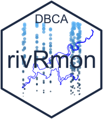

<!-- README.md is generated from README.Rmd. Please edit that file -->

# rivRmon 

<!-- badges: start -->

[](https://travis-ci.org/Bartesto/rivRmon)
[](https://ci.appveyor.com/project/Bartesto/rivRmon)
<!-- badges: end -->

The goal of rivRmon is to provide tools to aid in data munging and
visualisation of monitoring data from the Swan and Canning Rivers.

## Installation

You can install the development version from
[GitHub](https://github.com/Bartesto) with:

``` r
# install.packages("devtools")
devtools::install_github("Bartesto/rivRmon")
library(rivRmon)
```

## Help Files

All functions within rivRmon have the usual R help files, however the
best place to see these and some vignettes is the [rivRmon
website](https://Bartesto.github.io/rivRmon/index.html)
