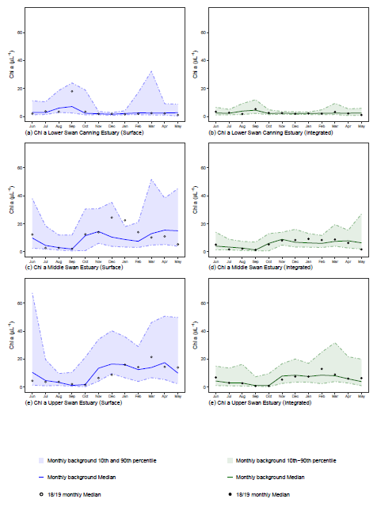
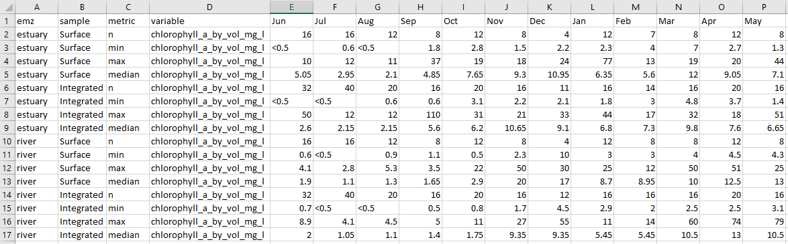

```{r, include = FALSE}
knitr::opts_chunk$set(
  collapse = TRUE,
  comment = "#>"
)
```

# Introduction
All water quality data, historical and present, is accessed through the Water 
Information Reporting portal maintained by the Department of Water and 
Environment 
[link](http://wir.water.wa.gov.au/Pages/Water-Information-Reporting.aspx). Data 
should be downloaded for the Canning Estuary and the Swan Estuary sites 
using the keywords search terms "SG-E-CANEST" and "SG-E-SWANEST" respectively. 
Data requested should be "Water Quality (discrete) for Site(s) cross-tabulated" 
and as the data size is large, requests should be split into appropriate yearly 
chunks. This data is the starting point for using the functions that follow to 
produce plots and tables for the annual reports. It is suggested that the 
original downloads be kept and the data simply updated yearly.

The plots created by the functions are output as panel plots and follow the same 
format as previous annual reports. A panel is based on a variable and contains 
a separate plot for each combination of ecological management zone (emz) and 
sampling method. Visualisation consists of:

+ a "ribbon" designating the 10th and 90th percentiles of the background data
+ a line showing the background data median
+ points showing the current reporting period medians

The tables generated from the same functions contain counts, minimums, maximums 
and medians for the current reporting period per month. These are summarised by 
emz and sampling method and can be copied straight into the report when it is 
being compiled.

The process for creating the plots and tables has two stages.

# Stage One - Data assembly
Data required for the annual reports consists of a current reporting period (01 
June to 31 May) and background period (5 years prior to current reporting 
period). In this stage all downloaded data is read in and categorised into a 
current and background period. The downloaded data has some challenging 
formatting (for automatic reading and variable naming etc) so these functions 
are very specific to the current export format. Should this format change these 
functions will fail and require some editing.

When the report is read in it is tidied with the following occuring:

+ variable names are standardised
+ values are checked for "<" or ">":
  + a value following a "<" is halved
  + a value following a ">" is left as is
+ the variable emz is created based on site

Once the data is read in and tidied it is exported as a csv with the format
"XX-X-XXXXX_annual_report_data_for_YYY.csv" where:

+ "XX-X-XXXXX" is the estuary (i.e. SG-E-CANEST or SG-E-SWANEST)
+ "YYYY" is the current reporting year.

Remember to change the file path slashes if on a Windows OS. Examples below.

```{r eval=FALSE}
#load the package
library(rivRmon)

#Canning estuary - forward slash example
canning_WIN_report_data(inpath = "C:blah/blah/annual_data_location", 
                        reportingYear = 2019, 
                        outpath = "C:blah/blah/somewhere")

#Swan estuary - backslash example
swan_WIN_report_data(inpath = "C:blah\\blah\\annual_data_location", 
                     reportingYear = 2019, 
                     outpath = "C:blah\\blah\\somewhere")

```

**inpath** is a character file path to the downloaded data xlsx files
**reportingYear** is a 4 digit numerical representing current reporting year
**outpath** is a character file path to desired export location for writing of 
the csv files

This function needs to be run each year to set up the data for the annual 
report. The output from this stage will be the input for the next two stages.

# Stage Two - Creating plots and tables
There is a separate function for each estuary. These are essentially wrapper 
functions around other functions that work on data that has the same 
requirements for visualisation (mainly formatting such as plots per panel, 
or data filtering parameters etc). Outputs are saved to directories created by 
running the functions. There will be a `panels` and a `tables` directory with 
the prefix "c_" or "s_" for Canning and Swan estuaries respectively.

```{r eval=FALSE}
#Canning estuary - forward slash example
canning_reportR(inpath = "C:blah/blah/somewhere", 
                outpath = "C:blah/blah/somewhere_else", 
                surface = "blue", 
                bottom = "red",
                chloro = "darkgreen")

#Swan estuary - backslash example
swan_reportR(inpath = "C:blah\\blah\\somewhere", 
                outpath = "C:blah\\blah\\somewhere_else", 
                surface = "blue", 
                bottom = "red",
                chloro = "darkgreen")
```

**inpath** a character file path to pre-made annual report data (the out path from 
Stage 1 above)

**outpath** a character file path to desired export location

The parameters **surface**, **bottom** and **chloro** can take a named colour or 
a [hex colour code](http://instant-eyedropper.com/info/html_color_code/). The 
defaults produce colours similar to those produced in prior reports, however 
access to these parameters allows users to tweak if required. **surface** 
relates to surface measurements, **bottom** to bottom measurements and 
**chloro** to integrated measurements specific only to chlorophyll plots.

### Examples
Canning estuary total oxidised nitrogen.


Swan estuary chlorophyll a.



Chlorophyll a csv table



# Groupings of variables
As stated previously some variables are grouped so that code can filter data under similar circumstances. These groupings are as follows.

For the Canning estuary:

+ chlorophyll a - by itself
+ dissolved organic carbon - by itself
+ group 1
  + total nitrogen
  + ammonia nitrogen
  + total oxidised nitrogen
  + dissolved organic nitrogen
  + total phosphorus
  + filterable reactive phosphorus
+ group 3
  + dissolved oxygen
  + pH
  + salinity
  + temperature
+ secchi depth - by itself
+ silica - by itself

For the Swan estuary:

+ chlorophyll a - by itself
+ group 1
  + total nitrogen
  + ammonia nitrogen
  + total oxidised nitrogen
  + dissolved organic nitrogen
  + total phosphorus
  + filterable reactive phosphorus
  + silica
+ group 2
  + alkalinity (not report variable for Canning estuary)
  + dissolved organic carbon
  + tss (not report variable for Canning estuary)
+ group 3
  + dissolved oxygen
  + pH
  + salinity
  + temperature
+ secchi depth

Note that `swan_reportR` outputs 2 panel plots as per the original report for 
the group 3 variables. The extra panel plots are for the additional emz of 
"Swan". 

# Plotting individual variable groupings
As previously mentioned, the reportR functions are wrappers. The individual 
functions are available to the user and can be found in the reference index. The 
groupings match the above and function names take the format `ann_rep_vvvv_e()` 
where:

+ "vvvv" is the variable or grouping
+ "_e" is the estuary ("_c" or "_s")

As these functions are written to be internal to the wrapper they need to be run 
in the following manner in order to read in the correct data.

```{r eval=FALSE}
#load additional packages
library(tidyverse)

#setup a file path to the annual report data (i.e. csv from Stage One)
inpath <- "C:path/to/anuual_report_data"

#get the full name and pathrow to the required data - change pattern as required
file <- list.files(path = inpath, pattern = "SG-E-CANEST_annual_report", 
                   full.names = TRUE)

#create parameter variables for the function you want to use
outpath <- "C:path/to/desired_export_location"
data <- readr::read_csv(file = file, guess_max = 10000)

#run function - here we have chosen group 1 variables for the Swan
ann_rep_grp1_s(outpath, data, surface = "blue", bottom = "red")
```
