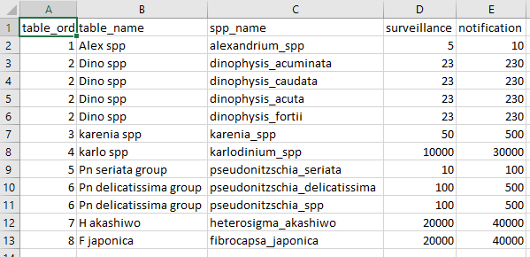

```{r, include = FALSE}
knitr::opts_chunk$set(
  collapse = TRUE,
  comment = "#>"
)
```

# Introduction
These functions have been created to aid in compiling the HAB reports by creating 
a conditionally formatted table in pptx format.

# Stage One - Create summary data
Phytoplankton count data in its raw form (hereafter called raw data) provides 
count and other information for a multitude of species. This data is analysed 
and provided to us by the Department of Water and Environmental Regulation's 
Phytoplankton Ecology Unit. In order to compile the HAB report the data needs to 
be summarised to reflect only HAB related data. This first stage undertakes this process and outputs summaries that are used in stage two.

An important parameter for these functions is the "mngt_response_triggers" csv. 
This is a csv file containing a table that reflects current summary groups, 
included species and trigger threshold values for the HAB report. This information 
not only guides the summary but its layout also guides the final format of the 
output pptx file. Below is an example.



The table variables are:

* `table_ord` this is the ordering of the `table_name` groupings as they will 
appear in the final output. Each unique group must have its own `table_ord` number.
* `table_name` this is a broad grouping to which individual species will be 
assigned to. Multiple species can be assigned to a single group. This `table_name` 
reflects exactly the desired format for the output pptx file.
* `spp_name` this is the species names and should follow the same format, i.e. 
snake_case. Make sure the spelling is as is reported in the raw phytoplankton 
data.
* `surveillance` any value equal to this number and less than or equal to the 
`notification` value will be classified as "surveillance" and coloured orange in
the output pptx file.
* `notification` any value greater than this will be classified as "notification" 
and will be coloured red in the output pptx file.

To make things easier to setup, the `rivRmon` package comes with an example. This can be read in, adjusted accordingly to reflect current trigger species and thresholds and then saved to csv for later use. To do this follow the example below.

```{r eval=FALSE}
#load the package
library(rivRmon)

#assign the internal data to an object called triggers
triggers <- mngt_response_triggers

#you can then save straight to csv and edit as you would an excel file
readr::write_csv(triggers, path = "C:/some_file/path")
```

After making sure you have access to either the current management trigger info,
or have created your own, you need to supply two file paths. One to the raw data
xlsx spreadsheets and a file path to the desired location of the exported summary
data. This summary data will be written to a `HAB_tables/` directory and if it 
doesn't already exist it will be created. Your next function call should look 
something like the below.

```{r eval=FALSE}
#run the hab_groupR function
hab_groupR(pathin = "C:/path/to/raw_data", pathout = "C:/path/for_export",
           mngt_triggers = "C:/path/to/trigger/data")
```

The only thing to be careful of is ensuring that if you are copying a fiile path 
from a Windows OS you will need to double all the backslashes for the path to be 
recognised. The above example is the alternative method where the backslashes 
are converted to a single forward slash. 

Lastly there are two parameters that have default values. 

* `skip` defaults to 5. The format of the raw data has 5 lines of unrequired 
metadata at the top. If the format changes this can be changed too.
* `shell` refers to a possible new site on the Canning River. The default for this is FALSE. If this site becomes a permanent addtion to the monitoring then 
changing this value to TRUE will ensure this site is reflected in the summaries 
and output pptx file.

# Stage Two - Creating the conditionally formatted pptx file
This next stage reads in all the summary HAB data csv's and based on the date 
provided, generates a table containing the current and prior week's cell counts 
for the groupings indicated in the trigger data with conditionally coloured text to indicate classification.

To accomplish this, run code similar to the below.
```{r eval=FALSE}
#run the hab_tablR function
hab_tablR(hab_tables = "C:/path/to/HAB_tables", date = "20190715", 
          mngt_triggers = "C:/path/to/trigger/data")
```

The `hab_tables =` input for the `hab_tablR()` function is a file path to the location of the `HAB_tables/` directory not the summary csv's themselves. This is essentially the **pathout** parameter that you specified when running `hab_groupR()`. Note that the format for the date is "yyyymmdd" and can be 
presented as above in the code snippet or contain separators (e.g. "2019/07/15" 
or "2019-07-15").

The output will be a single page of a PowerPoint with a table of different 
coloured counts per site (depending on the river). This table can be then either 
incorporated into an existing report and formatted for page size and any other tweaks or values can be copied out and put into a "pre-formatted" table. 

