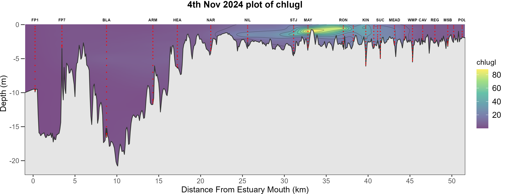
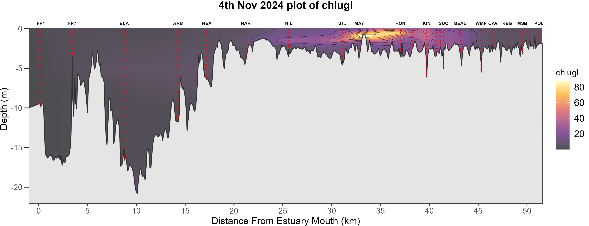

```{r, include = FALSE}
knitr::opts_chunk$set(
  collapse = TRUE,
  comment = "#>"
)
```
# Introduction

Sometimes it is useful to have the ability to make a quick surfer styled plot. 
The metric could be one of the normal metrics as plotted by using `swan_sufR()` 
for example or any of the other metrics that are recorded by the sonde. 

Whilst it is easy enough to plot up a metric by writing your own code, the benefit 
of using the new `plot_metric()` function is that it is using the `rivRmon` package 
data to plot the river bottom, interpolate between samples and label the sampling 
sites.

# Creating a metric plot

Firstly the user needs to compile and edit the sonde data so the data is in a 
consistent format. This entails: 

+ Creating a new excel workbook with a single sheet. The sheet must be named 
"edited data".

+ Copying the data from the two consecutive river sampling days into the above sheet.

+ Editing the `Date` column. Ensure this has only one unique date, it can be the 
first or the second day of sampling but cannot be both.

+ Editing the vertical position column. It must be named `vpos` and not `vpos m`.

+ Deleting unused columns. The most important one to delete is the `Dep M` column. It is also good practice to delete `Time`, `Sample Number`, `User ID`, `BGA...` and the `Lat` and `Long` columns. See below for an example.


NOTE at this stage the BGA data cannot be plotted. This is because one sonde records 
BGA-PC and the other, BGA-PE. If this situation changes in the future then whichever 
metric is consistently recorded can be included in the plots by leaving it in the data. 

Next the function can be run. It has 3 basic parameters. A file path (character string) 
to the excel workbook as described above, a colour (character string) to represent 
the colour of the sampling points and lastly a letter (character string) designating 
which of the Viridis colour scales to use, [see ggplot2 doco for the 'option' parameter](https://ggplot2.tidyverse.org/reference/scale_viridis.html). Example usage below.

```{r eval=FALSE}
#load the package
library(rivRmon)

plot_metric(path = "C:data_location/the workbook you created.xslx", samp = "red", 
            colscale = "d")

```

The naming convention of the workbook can be whatever makes sense for the user. Internally the function will determine which river you are plotting. 

When the function is called it will present the user with a numbered list of metrics 
available to plot, as per example below. The user inputs a number corresponding to their metric of choice. 
This negates awkward representations of temperature symbols etc.


Plots will be rendered in png format and will be saved to a directory called `metric_plots` located in your current working directory. Some examples below.

A plot of the Swan river showing chlorophyll in the default colour scale ("d").
{width=110%}

A plot showing the same in the inferno ("b") colour scale.
{width=110%}

A couple of things to note:

+ The `samp` parameter is useful to highlight the sampling points by chosing a colur that stands out from the background colour scale choice.

+ The `colscale` parameter choices are nothing like the standard colours used in the weekly surfer plots. These Viridis colour scales are a flexible choice when plotting metrics which we have not defined a discrete colour scale for.

+ Also be aware that the data range present in the sonde data will always scale to the Viridis continuous colour scales. As such the same colours will be present in winter and summer data. These plots are not intended to compare through time but are an ad hoc glimpse showing the present concentrations of the metric of choice.

+ Lastly `plot_metric` behaves similarly to the surfer functions in that it has logic to define the status of the Kent St Weir and will plot up all sampling locations whilst only labeling the usual spots.