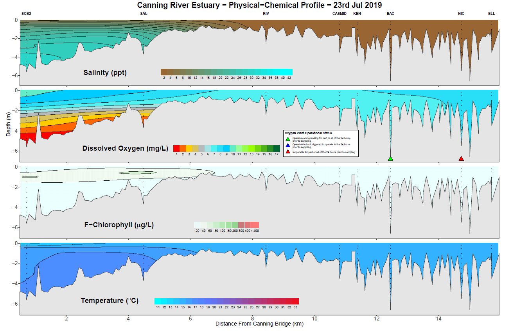
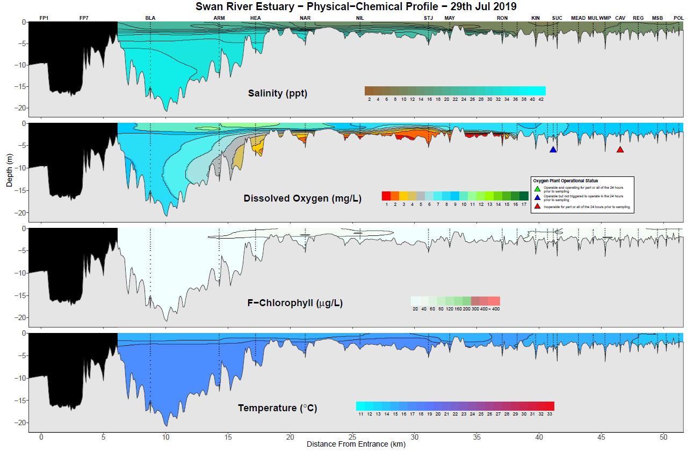
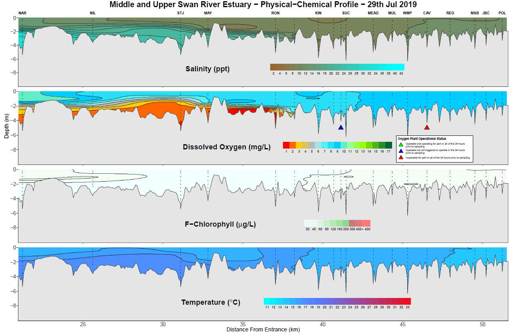

```{r, include = FALSE}
knitr::opts_chunk$set(
  collapse = TRUE,
  comment = "#>"
)
```
# Introduction

Surfer or profile plots are visualisations of 4 physical and chemical metrics 
along the Swan and Canning rivers. These metrics are, salinity, dissolved 
oxygen, chlorophyll and temperature and are interpolated along the river length 
to give a seamless visualisation. 

Two sections of the Swan/Canning river system are monitored on a weekly basis. 
The Canning river estuary (between South Canning Bridge and Ellison drive) and 
the Swan river estuary (between Blackwall Reach and the Power Line crossing in
West Swan).

The raw input to create these plots comes from sonde data recorders deployed 
on consecutive days each week. Due to the length of time needed sample either of 
the rivers, two vessels start at different locations to enable recording of data 
in the one day. Therefore the raw data for one day's sampling is two excel 
spreadsheets.

# Creating a surfer plot

The functions to create the surfer plots are slightly different internally. It 
is important to note that these functions are very specific to the river and 
the expected inputs and parameters. 

To run the functions make sure the package is loaded. The path variable is a 
character string of the file path to the locations of the sonde data for the day 
you wish to plot. As described above there should be two excel spreadsheets. 
Make sure that you have the right data for the right function. Sonde data has a 
"c" in the name for the Canning and a "s" for the Swan. Please ensure that if 
you copy and paste in a file path from a Windows OS you will need to either 
double up the backslashes or convert them to a single forward slash.

The other two parameters supplied to either function relate to the oxygenation 
status at two locations and are specific to each river. Permissable colours are
green, blue and red. 

When run the function will read in the sonde data, process the interpolations 
and generate the plots. The plots will be written to a directory created at the 
same location as the sonde data, called "plots". Examples below.

```{r eval=FALSE}
#load the package
library(rivRmon)

#Canning river - forward slash example
canning_surfR(path = "C:blah/blah/data_location", obac = "green", onic = "red")

#Swan river - backslash example
swan_surfR(path = "C:blah\\blah\\data_location", ovit = "blue", ocav = "red")

```

## Canning river example

This plot was produced using the parameters as described above on data from 
23/07/2019 using the `canning_surfR()` function. Note that the block-like 
structure downstream of site KEN represents the Kent street weir in an open 
position. The function will interpret the status of the weir from the sonde data 
and plot it accordingly.

{width=110%}


## Swan river examples

When the `swan_surfR()` function is run, it produces two outputs. One is a 
visualisation of the whole river from the river mouth to the Power Lines and the 
other is a zoomed view from the Narrows to the Power Lines. This to enable a 
more detailed view of the shallower waters.

Again these examples are run using the parameters as described above. Note the 
blacked out portions at the beginning of the plot. Blacked out regions cover 
sections of the river where data was not collected on that date. The sites here
(FP1 and FP7) are within the Port of Fremantle and data is sometimes provided. 
Other sections of the river may be blacked out from time to time and could be 
due to equipment malfunction or more generally an inability to hold station at a
site due to conditions on the day (strong wind, strong current etc).

{width=110%}

And here is an example of the middle and upper Swan showing greater detail.

{width=110%}


# Things to note

 + The current functions can handle the outputs from YSI and EXO sondes and can 
handle most of the historical differences in metric naming conventions and 
output formats. It is recommended however that the current conventions in place 
for naming and editing the sonde outputs should be maintained. Any major 
deviations or additions will likely result in errors.

+ The rendering of the "river bottom" is designed around long term monitoring 
locations. If a new site needs to be added this will require some rewriting of 
various parts of the base code and internal data sets. If this need arises please 
contact the author.

+ The "river bottom" has been created by extracting depths from the Corporate 
bathymetry data along a reckoned navigation route that attempts to stick to the 
deepest sections of the river and intersects the sampling sites. Additional 
extraction points are generated at 100 meter intervals along this route.

+ When the `canning_surfR()` function detects that the weir is closed (by the 
presence of cannoxy site data), it performs two interpolations to ensure that 
the weir is used as a barrier to the interpolations.

+ A thin plate spline is used to calculate the interpolation of data between the 
sampling sites.

+ Remember that this is a visualisation tool only. Obtaining precise 
measurements of metrics outside of sampling sites can only be obtained by 
physically sampling those areas. Any interpolation can only be an estimation, 
particularly with such sparse input data.


